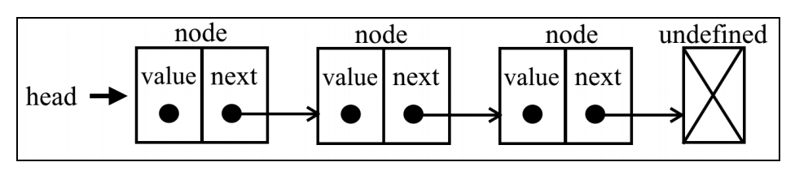

# 链表

链表存储有序的元素集合，但不同于数组，链表中的元素在内存中并不是连续放置的。每个
元素由一个存储元素本身的节点和一个指向下一个元素的引用（也称指针或链接）组成。

下图展示了一个链表的结构。


:::tip
相对于传统的数组，链表的一个好处在于，添加或移除元素的时候不需要移动其他元素。然而，链表需要使用指针，
因此实现链表时需要额外注意。在数组中，我们可以直接访问任何位置的任何元素，
而要想访问链表中间的一个元素，则需要从起点（表头）开始迭代链表直到找到所需的元素。
:::

## 创建链表

```js
// models/linked-list-models.js
export class Node {
  constructor(element) {
    this.element = element
    this.next = undefined
  }
}
```

```js
// utils.js
export function defaultEquals(a, b) {
  return a === b
}
```

```js
import { defaultEquals } from '../util'
import { Node } from './models/linked-list-models' // {1}
export default class LinkedList {
  constructor(equalsFn = defaultEquals) {
    this.count = 0 // {2}
    this.head = undefined // {3}
    this.equalsFn = equalsFn // {4}
  }
}
```

LinkedList 类的方法

- push(element)：向链表尾部添加一个新元素。
- insert(element, position)：向链表的特定位置插入一个新元素。
- getElementAt(index)：返回链表中特定位置的元素。如果链表中不存在这样的元素，
  则返回 undefined。
- remove(element)：从链表中移除一个元素。
- indexOf(element)：返回元素在链表中的索引。如果链表中没有该元素则返回-1。
- removeAt(position)：从链表的特定位置移除一个元素。
- isEmpty()：如果链表中不包含任何元素，返回 true，如果链表长度大于 0 则返回 false。
- size()：返回链表包含的元素个数，与数组的 length 属性类似。
- toString()：返回表示整个链表的字符串。由于列表项使用了 Node 类，就需要重写继
  承自 JavaScript 对象默认的 toString 方法，让其只输出元素的值。

## 向链表尾部添加元素

```js
push(element) {
  const node = new Node(element) // {1}
  let current // {2}
  if (this.head == null) {
    // {3}
    this.head = node
  } else {
    current = this.head // {4}
    while (current.next != null) {
      // {5} 获得最后一项
      current = current.next
    }
    // 将其 next 赋为新元素，建立链接
    current.next = node // {6}
  }
  this.count++ // {7}
}
```

首先需要做的是把 element 作为值传入，创建 Node 项（行{1}）。

先来实现第一个场景：向空列表添加一个元素。当我们创建一个 LinkedList 对象时，head
会指向 undefined（或者是 null）。

如果 head 元素为 undefined 或 null（列表为空——行{3}），就意味着在向链表添加第一
个元素。因此要做的就是让 head 元素指向 node 元素。下一个 node 元素会自动成为 undefined。

再来看看第二种场景，也就是向一个不为空的链表尾部添加元素。

要向链表的尾部添加一个元素，首先需要找到最后一个元素。记住，我们只有第一个元素的
引用（行{4}），因此需要循环访问列表，直到找到最后一项。为此，我们需要一个指向链表中
current 项的变量（行{2}）。

在循环访问链表的过程中，当 current.next 元素为 undefined 或 null 时，我们就知道
已经到达链表尾部了（行{5}）。然后要做的就是让当前（也就是最后一个）元素的 next 指针指
向想要添加到链表的节点（行{6}）。
:::tip
链表最后一个节点的下一个元素始终是 undefined 或 null。
:::

## 从链表中移除元素

我们要实现两种 remove 方法：

第一种是从特定位置移除一个元素（removeAt），第二种是根据元素的值移除元素（稍后我们会
展示第二种 remove 方法）。和 push 方法一样，对于从链表中移除元素也存在两种场景：第一
种是移除第一个元素，第二种是移除第一个元素之外的其他元素。

removeAt 方法的代码如下所示。

```js
removeAt(index) {
  // 检查越界值
  if (index >= 0 && index < this.count) {
    // {1}
    let current = this.head // {2}
    // 移除第一项
    if (index === 0) {
      // {3}
      this.head = current.next
    } else {
      let previous // {4}
      for (let i = 0; i < index; i++) {
        // {5}
        previous = current // {6}
        current = current.next // {7}
      }
      // 将 previous 与 current 的下一项链接起来：跳过 current，从而移除它
      previous.next = current.next // {8}
    }
    this.count-- // {9}
    return current.element
  }
  return undefined // {10}
}
```

由于该方法要得到需要移除的元素的 index（位置），我们需要验证该 index 是有效的（行{1}）。
从 0（包括 0）到链表的长度（count – 1，因为 index 是从零开始的）都是有效的位置。
如果不是有效的位置，就返回 undefined（行{10}，即没有从列表中移除元素）。

如果想移除第一个元素，要做的就是让 head 指向列表的第二个元素。我们将用
current 变量创建一个对链表中第一个元素的引用（行{2}——我们还会用它来迭代链表，但
稍等一下再说）。这样 current 变量就是对链表中第一个元素的引用。如果把 head 赋为
current.next，就会移除第一个元素。我们也可以直接把 head 赋为 head.next（不使用
current 变量作为替代）。

如果要移除链表的最后一个或者中间某个元素。为此，需要迭代链表的节点，直
到到达目标位置（行{5}）。一个重要细节是：current 变量总是为对所循环列表的当前元素的
引用（行{7}）。我们还需要一个对当前元素的前一个元素的引用（行{6}），它被命名为 previous
（行{4}）。

在迭代到目标位置之后，current 变量会持有我们想从链表中移除的节点。因此，要从链
表中移除当前元素，要做的就是将 previous.next 和 current.next 链接起来（行{8}）。这
样，当前节点就会被丢弃在计算机内存中，等着被垃圾回收器清除。

## 循环迭代链表直到目标位置

```js
getElementAt(index) {
  if (index >= 0 && index <= this.count) {
    // {1}
    let node = this.head // {2}
    for (let i = 0; i < index && node != null; i++) {
      // {3}
      node = node.next
    }
    return node // {4}
  }
  return undefined // {5}
}
```

## 在任意位置插入元素

使用该方法可以在任意位置插入一个元素。我们来看一看它的实现。

```js
insert(element, index) {
  if (index >= 0 && index <= this.count) {
    // {1}
    const node = new Node(element)
    if (index === 0) {
      // 在第一个位置添加
      const current = this.head
      node.next = current // {2}
      this.head = node
    } else {
      const previous = this.getElementAt(index - 1) // {3}
      const current = previous.next // {4}
      node.next = current // {5}
      previous.next = node // {6}
    }
    this.count++ // 更新链表的长度
    return true
  }
  return false // {7}
}
```
